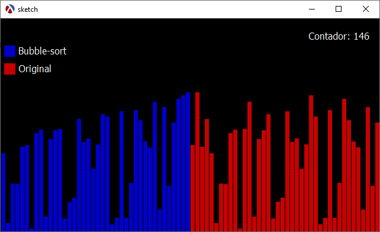

### Visualizador de Bubble Sort en Racket y Sketching

#### Descripción
Este proyecto es un visualizador para el algoritmo de ordenación Bubble Sort, implementado usando el lenguaje de programación Racket con la biblioteca Sketching. El código genera una ventana gráfica que muestra dos conjuntos de barras. El conjunto de la izquierda se ordena en tiempo real usando el algoritmo de Bubble Sort, mientras que el conjunto de la derecha permanece en su estado original para comparación. Además, se muestra un contador de operaciones en la esquina superior derecha de la ventana.

#### Características
- Genera n valores aleatorios para las barras en `(define n 40)`.
- Se define el ancho y alto de la ventana en  `(define ancho-ventana 640)` y `(define alto-ventana 360)`.
- Se define la velocidad a través del framerate `(frame-rate 200)`.
- Utiliza el algoritmo de Bubble Sort para ordenar el conjunto de barras de la izquierda.
- Muestra un contador de operaciones en la esquina superior derecha de la ventana.
- Añade leyendas con cuadros de colores para indicar qué conjunto de barras se está ordenando y cuál es el original.

#### Imagen Demostrativa
Imagen Demostrativa del Visualizador de Bubble Sort

Para visualizar el estado en tiempo real del algoritmo, ejecute el código en un entorno que soporte Racket como DrRacket con la biblioteca Sketching.

